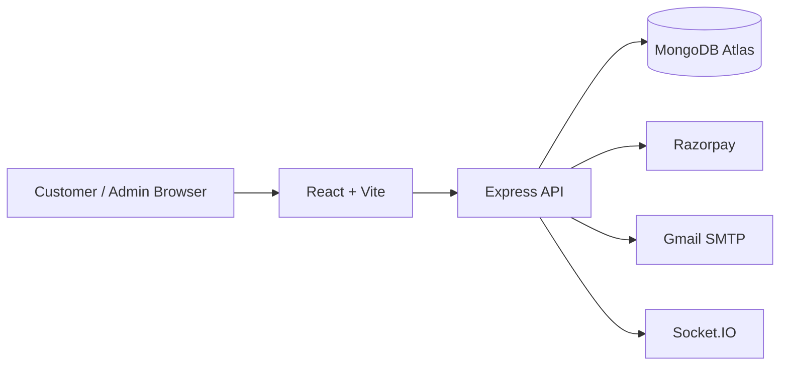
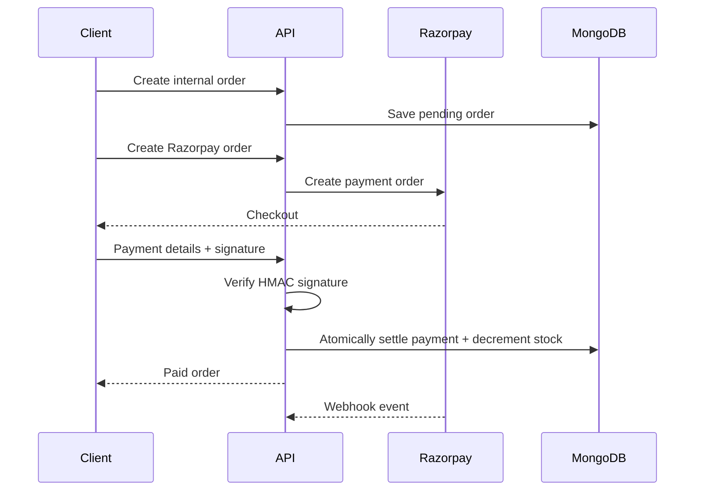

# PizzaCraft — MERN Pizza Delivery & Inventory Platform

PizzaCraft is a production-style full-stack pizza ordering and inventory management application built with the MERN ecosystem. Users can create custom pizzas, complete Razorpay payments, track orders, and manage their account. Administrators can manage ingredients, inventory, and order status.

## Features

### Customer

- User registration and email verification
- JWT-based authentication
- Login/logout and protected routes
- Forgot-password and reset-password flow
- Custom pizza builder
- Live ingredient availability and pricing
- Razorpay Test Mode payments
- Order history
- Real-time order-status updates with Socket.IO

### Admin

- Admin-only dashboard
- Ingredient CRUD
- Stock management
- Low-stock thresholds
- Low-stock email alerts
- Order listing and filtering
- Controlled order-status progression

### Backend reliability and security

- Server-side ingredient validation and price calculation
- Inventory deduction after successful payment settlement
- Razorpay signature verification
- Razorpay webhook handling
- Payment reconciliation fallback
- Request validation
- Rate limiting
- Security headers
- Centralized error handling

## Tech Stack

| Layer            | Technology                               |
| ---------------- | ---------------------------------------- |
| Frontend         | React, Vite, React Router, Axios         |
| Backend          | Node.js, Express                         |
| Database         | MongoDB, Mongoose                        |
| Authentication   | JWT, bcryptjs                            |
| Payments         | Razorpay                                 |
| Email            | Nodemailer + Gmail SMTP                  |
| Real-time        | Socket.IO                                |
| Scheduling       | node-cron locally + Vercel Cron fallback |
| Deployment       | Vercel                                   |
| Database hosting | MongoDB Atlas                            |

## Project Structure

```text
WebDev-L3-T1-PizzaDelivery/
├── client/
│   ├── src/
│   ├── public/
│   ├── package.json
│   └── vercel.json
│
├── server/
│   ├── src/
│   │   ├── config/
│   │   ├── controllers/
│   │   ├── jobs/
│   │   ├── middleware/
│   │   ├── models/
│   │   ├── routes/
│   │   ├── services/
│   │   ├── sockets/
│   │   ├── app.js
│   │   ├── index.js
│   │   └── server.js
│   ├── package.json
│   └── vercel.json
│
├── docs/
├── .gitignore
└── README.md
```

## Architecture



See [docs/architecture.md](docs/architecture.md) for the detailed architecture and request flows.

## Local Setup

### Requirements

- Node.js 22+ recommended
- npm
- MongoDB local installation or MongoDB Atlas
- Razorpay Test Mode account
- Gmail account with App Password for SMTP

### 1. Clone the repository

```bash
git clone https://github.com/yashodipdeore2006/OIBSIP.git
cd OIBSIP/WebDev-L3-T1-PizzaDelivery
```

### 2. Install backend dependencies

```bash
cd server
npm install
```

Create `server/.env` from `server/.env.example`.

### 3. Install frontend dependencies

```bash
cd ../client
npm install
```

Create `client/.env` from `client/.env.example`.

### 4. Start the backend

```bash
cd ../server
npm run dev
```

The local API runs on:

```text
http://localhost:5000
```

Health check:

```text
http://localhost:5000/api/health
```

### 5. Start the frontend

In another terminal:

```bash
cd client
npm run dev
```

The Vite app normally runs on:

```text
http://localhost:5173
```

## Environment Variables

Never commit real credentials.

### Backend

```env
NODE_ENV=development
PORT=5000
CLIENT_URL=http://localhost:5173

MONGO_URI=mongodb://localhost:27017/PizzaDeliveryApp

JWT_SECRET=replace_me
JWT_EXPIRES_IN=7d

SMTP_HOST=smtp.gmail.com
SMTP_PORT=465
SMTP_SECURE=true
SMTP_USER=
SMTP_PASSWORD=
EMAIL_FROM=Pizza Delivery <your-email@example.com>

RAZORPAY_KEY_ID=
RAZORPAY_KEY_SECRET=
RAZORPAY_WEBHOOK_SECRET=

CRON_SECRET=
```

### Frontend

```env
VITE_API_URL=http://localhost:5000/api
VITE_SOCKET_URL=http://localhost:5000
```

## API Overview

The main route groups are:

```text
/auth
/ingredients
/orders
/payments
/admin
/admin/inventory
```

See [docs/api.md](docs/api.md) for endpoint details.

## Payment Flow



See [docs/payments.md](docs/payments.md).

## Authentication Flow

```text
Register
  ↓
Verification email
  ↓
Verify email
  ↓
Login
  ↓
JWT token
  ↓
Protected routes
  ↓
Admin role check for admin routes
```

See [docs/authentication.md](docs/authentication.md).

## Deployment

The current monorepo can be deployed as separate Vercel projects:

```text
GitHub repository
├── client → Vercel frontend
└── server → Vercel backend
```

Typical production dependencies:

```text
React/Vite → Vercel
Express → Vercel
MongoDB → MongoDB Atlas
Payments → Razorpay
Email → Gmail SMTP
```

See [docs/deployment.md](docs/deployment.md).

## Database

Current core collections:

```text
users
ingredients
orders
```

See [docs/database.md](docs/database.md).

## Security Notes

- Keep `.env` files out of Git.
- Store server-side secrets only in backend environment variables.
- Do not expose `RAZORPAY_KEY_SECRET`, `MONGO_URI`, `JWT_SECRET`, SMTP passwords, webhook secrets, or `CRON_SECRET` in frontend variables.
- `VITE_*` variables are client-visible by design.
- Use strong, unique production secrets.
- Rotate any secret that has been publicly exposed.

## Admin Setup

The application uses the `role` field on the user document:

```text
user
admin
```

A normal account can be created through registration. For local development, the role can then be changed from `user` to `admin` in MongoDB. After changing the role, log out and log back in so a new JWT contains the updated role.

## Documentation

- [Architecture](docs/architecture.md)
- [API](docs/api.md)
- [Database](docs/database.md)
- [Deployment](docs/deployment.md)
- [Authentication](docs/authentication.md)
- [Payments](docs/payments.md)

## Contributing

1. Fork the repository.
2. Create a feature branch.
3. Make and test your changes.
4. Keep secrets out of commits.
5. Open a pull request with a clear description.

## License

MIT License

Copyright (c) 2026 Yashodip Deore

Permission is hereby granted, free of charge, to any person obtaining a copy
of this software and associated documentation files (the "Software"), to deal
in the Software without restriction, including without limitation the rights
to use, copy, modify, merge, publish, distribute, sublicense, and/or sell
copies of the Software, and to permit persons to whom the Software is
furnished to do so, subject to the following conditions:

The above copyright notice and this permission notice shall be included in
all copies or substantial portions of the Software.

THE SOFTWARE IS PROVIDED "AS IS", WITHOUT WARRANTY OF ANY KIND, EXPRESS OR
IMPLIED, INCLUDING BUT NOT LIMITED TO THE WARRANTIES OF MERCHANTABILITY,
FITNESS FOR A PARTICULAR PURPOSE AND NONINFRINGEMENT. IN NO EVENT SHALL THE
AUTHORS OR COPYRIGHT HOLDERS BE LIABLE FOR ANY CLAIM, DAMAGES OR OTHER
LIABILITY, WHETHER IN AN ACTION OF CONTRACT, TORT OR OTHERWISE, ARISING FROM,
OUT OF OR IN CONNECTION WITH THE SOFTWARE OR THE USE OR OTHER DEALINGS IN
THE SOFTWARE.

## Author

**Yashodip Deore**

GitHub: [@yashodipdeore2006](https://github.com/yashodipdeore2006)
