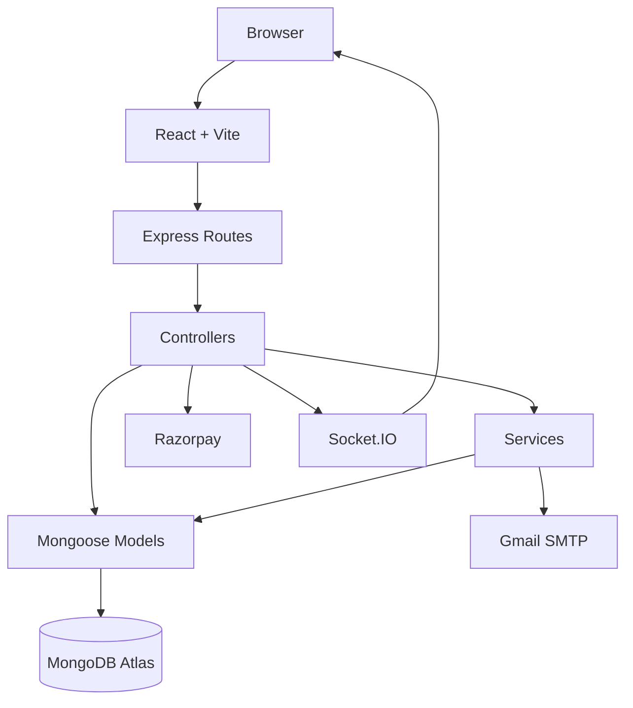
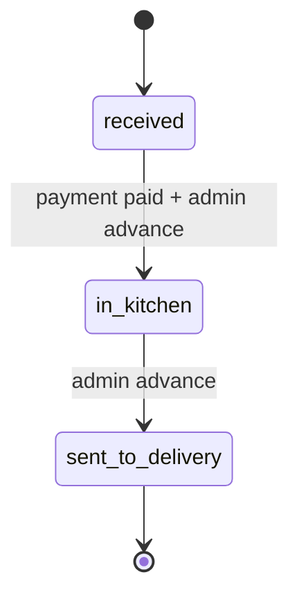

# Architecture

## Overview

PizzaCraft is a modular MERN application with a React client, an Express API, MongoDB persistence, Razorpay payments, SMTP email delivery, and Socket.IO real-time updates.



## Frontend

The frontend is responsible for:

- Routing and protected pages
- Authentication state
- Pizza builder UI
- Admin UI
- API requests through Axios
- Socket.IO client connection
- User-facing validation and feedback

## Backend

The backend is organized into:

```text
routes
  → middleware
  → controllers
  → services / models
  → MongoDB
```

### Controllers

Handle HTTP requests and response formatting.

### Services

Contain reusable domain logic such as email delivery and inventory operations.

### Models

Define MongoDB/Mongoose schemas for users, ingredients, and orders.

### Middleware

Handles:

- Authentication
- Authorization
- Validation
- Rate limiting
- Security headers
- Centralized errors

## Order Lifecycle



Orders cannot move backward and the current backend requires one status transition at a time.

## Payment Architecture

The server calculates the authoritative pizza price from ingredient documents. The client never determines the final payable amount.

After payment verification:

1. Razorpay signature is checked.
2. Required ingredient IDs are deduplicated.
3. Stock is decremented atomically.
4. The order is marked `paid`.
5. Webhooks/reconciliation can recover from browser interruption.

## Real-time Architecture

Authenticated Socket.IO clients join:

```text
user:<userId>
```

When an admin changes an order status, the server emits:

```text
order-status-updated
```

to the customer's room.

## Serverless Considerations

On Vercel, the API is designed to connect to MongoDB lazily and reuse the connection when the runtime instance is reused.

Long-running `node-cron` jobs are retained for local/server deployments. Vercel deployments use the maintenance endpoint as a scheduled fallback and Razorpay webhooks for payment events.
