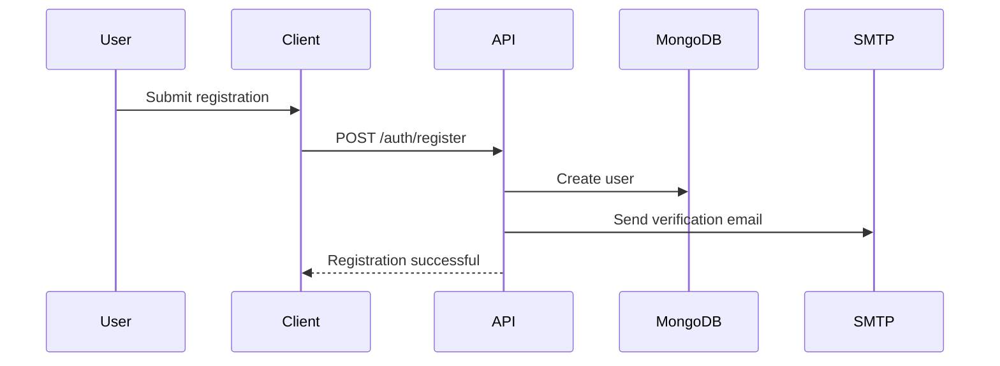
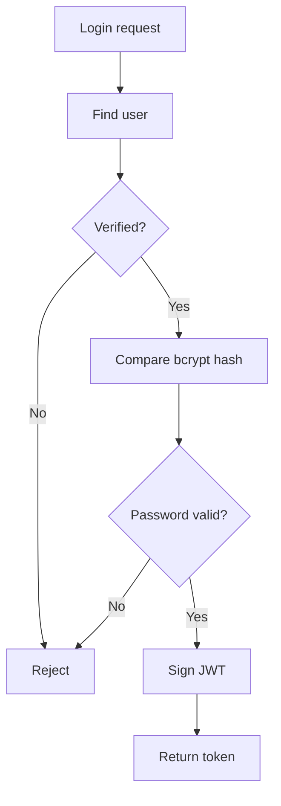

# Authentication

PizzaCraft uses JWT-based authentication combined with email verification and role-based authorization.

## Registration Flow



A registered user starts with:

```text
role = user
isEmailVerified = false
```

## Email Verification

The email contains a short-lived token.

```text
GET /api/auth/verify-email?token=<token>
```

The server only accepts the token while its expiration time is valid.

After successful verification:

```text
isEmailVerified = true
emailVerificationToken = null
emailVerificationExpires = null
```

## Login Flow



## JWT

The token payload contains:

```json
{
  "userId": "<userId>",
  "role": "user"
}
```

or:

```json
{
  "userId": "<userId>",
  "role": "admin"
}
```

Never expose `JWT_SECRET` to the frontend.

## Protected Routes

Authenticated requests use:

```http
Authorization: Bearer <token>
```

The authentication middleware verifies the token and attaches the authenticated user information to the request.

## Admin Authorization

Admin routes require:

```text
user.role === "admin"
```

Changing the role directly in MongoDB does not change an already-issued JWT. The user must log out and log back in so a new token carries the updated role.

## Password Reset

The reset flow is:

```text
Forgot password
      ↓
Short-lived reset token
      ↓
Email
      ↓
Reset password endpoint
      ↓
Bcrypt hash
      ↓
Invalidate token
```

## Security Practices

- Passwords are bcrypt-hashed.
- Verification/reset tokens are short-lived.
- Authentication endpoints are rate-limited.
- Tokens and secrets are stored outside the repository.
- Production errors avoid exposing internal exception details.
