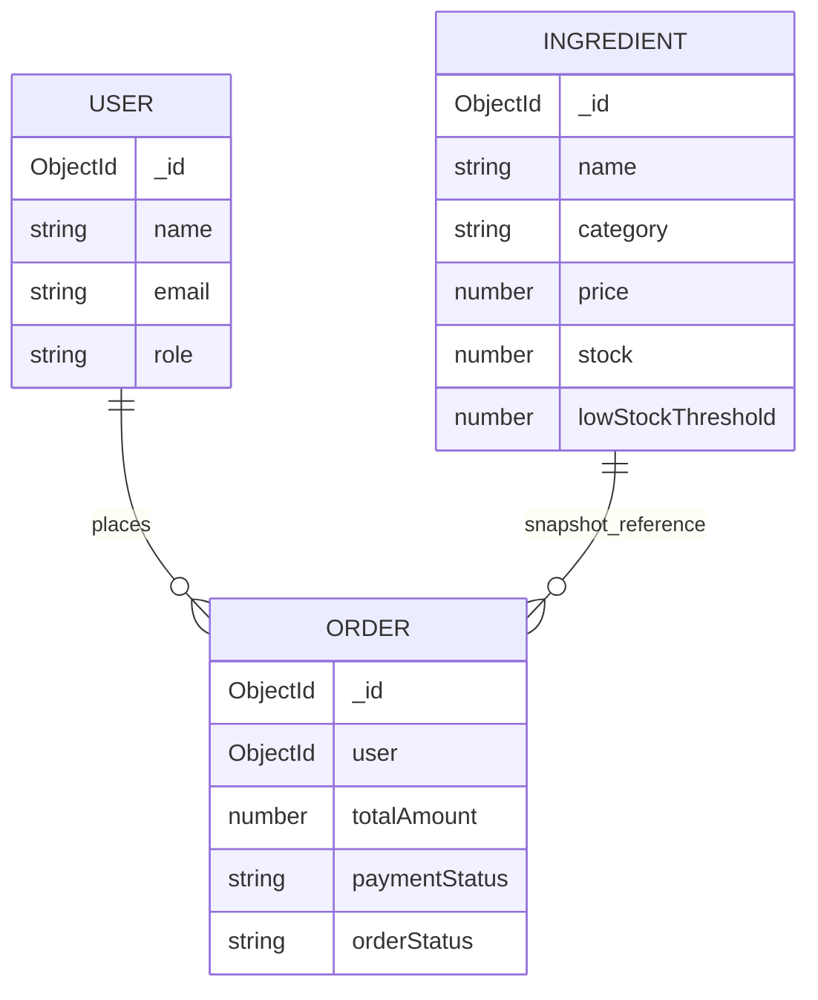

# Database Documentation

PizzaCraft uses MongoDB with Mongoose.

## Collections

```text
users
ingredients
orders
```

## User

Collection:

```text
users
```

Important fields:

| Field | Type | Purpose |
| --- | --- | --- |
| `name` | String | Display name |
| `email` | String | Unique login email |
| `password` | String | Bcrypt hash |
| `role` | String | `user` or `admin` |
| `isEmailVerified` | Boolean | Email verification state |
| `emailVerificationToken` | String/null | Temporary verification token |
| `emailVerificationExpires` | Date/null | Verification expiry |
| `passwordResetToken` | String/null | Temporary reset token |
| `passwordResetExpires` | Date/null | Reset expiry |

## Ingredient

Collection:

```text
ingredients
```

Allowed categories:

```text
base
sauce
cheese
vegetable
```

Important fields:

| Field | Type | Purpose |
| --- | --- | --- |
| `name` | String | Ingredient name |
| `category` | String | Ingredient category |
| `price` | Number | Unit price |
| `stock` | Number | Current stock |
| `lowStockThreshold` | Number | Alert threshold |
| `lowStockAlertSent` | Boolean | Duplicate-alert guard |

## Order

Collection:

```text
orders
```

The order stores a snapshot of selected ingredient names and prices, so historical orders do not depend on future catalog changes.

Main fields include:

- `user`
- `pizza.base`
- `pizza.sauce`
- `pizza.cheese`
- `pizza.vegetables`
- `totalAmount`
- `paymentStatus`
- Razorpay identifiers
- `paymentFailureReason`
- `paymentReconciledAt`
- `paymentWebhookEventId`
- `orderStatus`

Payment statuses:

```text
pending
paid
failed
refund_required
```

Order statuses:

```text
received
in_kitchen
sent_to_delivery
```

## Relationships



## Inventory Consistency

The final payment settlement uses an atomic conditional stock decrement:

```text
stock >= required quantity
        ↓
decrement stock
```

This prevents a successful payment flow from blindly driving inventory below zero.

## Seeding

For development, ingredient records can be inserted through MongoDB Atlas Data Explorer, `mongosh`, or a dedicated seed script.

Never seed real customer credentials into a public repository.
