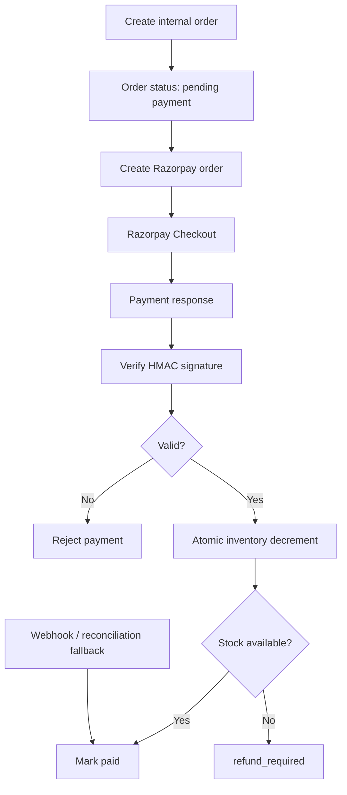

# Payments

PizzaCraft uses Razorpay Test Mode for payment processing.

## Core Principle

The browser does not decide the final price.

The backend receives ingredient IDs and calculates:

```text
base price
+ sauce price
+ cheese price
+ vegetable prices
= authoritative order total
```

## Payment Flow



## Razorpay Order

The backend creates a Razorpay order using the server-calculated amount.

The response exposes only the public Razorpay Key ID to the browser:

```env
RAZORPAY_KEY_ID=
```

The secret remains backend-only:

```env
RAZORPAY_KEY_SECRET=
```

## Signature Verification

The server verifies:

```text
HMAC-SHA256(
    razorpay_order_id + "|" + razorpay_payment_id,
    RAZORPAY_KEY_SECRET
)
```

The calculated signature is compared using a timing-safe comparison.

## Inventory Settlement

After a valid payment:

1. Start a MongoDB transaction.
2. Read the order.
3. Deduplicate selected ingredient IDs.
4. Atomically decrement stock.
5. Mark the order as paid.
6. Save Razorpay payment details.
7. Commit the transaction.

If stock cannot be reserved after capture, the order is marked:

```text
refund_required
```

so the captured payment can be reconciled/refunded manually.

## Webhooks

The endpoint is:

```text
POST /api/payments/webhook
```

Relevant events:

```text
payment.captured
payment.failed
order.paid
```

The webhook request is verified against:

```env
RAZORPAY_WEBHOOK_SECRET=
```

## Retry and Reconciliation

A customer can retry a pending/failed payment without creating a completely unrelated order.

The backend also includes payment reconciliation logic to check recent Razorpay orders for captured payments if the browser callback is interrupted.

## Production Notes

Before real-money payments:

- switch deliberately from Test Mode to Live Mode
- use live credentials only in server-side secret storage
- configure the live webhook
- establish a refund process
- monitor reconciliation failures
- test duplicate callbacks and retries
